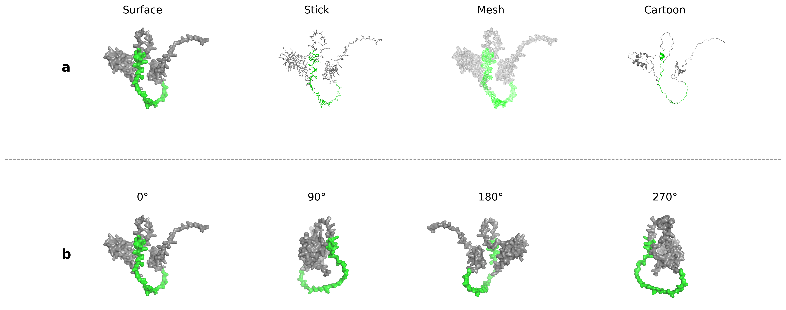

# MVCFF: Multi-View Complementary Feature Fusion for Protein Function Prediction  
## Introduction  
&nbsp;&nbsp;&nbsp;&nbsp;MVCFF is a neural network model designed for automatic protein function prediction (AFP) based on multi view amino acid sequence data.
In MVCFF, we design a sequence feature extraction subnetwork to capture view-specific information, including both local features of amino acid sequences and long-range dependencies. 
Subsequently, we propose a multi-view collaborative learning network that enables interaction among multi-view features to identify key fragment positions and achieve information gain. 
Finally, the integrated multi-view representation is fed into a downstream label predictor to accomplish the classification task.  
Repo Template

## Dependency
```markdown
python                    3.10.18 
matplotlib                3.10.0
numpy                     2.1.2
pandas                    2.3.1
scikit-learn              1.6.1
torch                     2.3.0
torchvision               0.18.0
tqdm                      4.65.0
```  

## Dataset
The dataset used in the experiments are provided as follows:  
cafa3 dataset is hosted in https://zenodo.org/records/7409660  
homo dataset can be found in https://www.uniprot.org/proteomes/UP000005640
## Train and Test  
### Train  
Navigate to the project source directory  
```markdown
cd src
``` 
Start training
```markdown
python train.py --phase train --datasets cafa3 --namespace mf --net_type MVFFNet --feats_type O_B_P --batch_size 8 --num_epochs 12
``` 
Description of parameters
```markdown
phase           work phase, "train"/"test"
batch_size      Batch size of the data，default 8      
num_epochs      Number of training epochs, default 12
namespace       GO ontology category, "mf"/"bp"/"cc"
datasets        Dataset name, "cafa3"/"homo"
net_type        Network type, "MLP"/"DeepGOCNN"/"DeepCNN"/"MVFFNet"
feats_type      Feature type(s), "O_B_P" represents One-hot, BERT, and PSSM
namespace_dir   Directory of GO ontology files
feats_dir       Directory of protein feature files
model_dir       Directory to save trained model, auto-generated if not provided
out_file        File path to save prediction results
```

### Test  
when phase is "test", The routine will load the Model file stored in the output directory.
Start testing
```markdown
python train.py --phase test --datasets cafa3 --namespace mf --net_type MVFFNet --feats_type O_B_P --batch_size 8
```
## Case  
&nbsp;&nbsp;&nbsp;&nbsp;We randomly selected an example to illustrate the practical performance differences between our proposed method MVCFF+ and baseline methods. 
The figure below shows the surface structure of the selected example.

&nbsp;&nbsp;&nbsp;&nbsp;The annotation term structure of the protein FA60A_MOUSE, based on experimental annotations (GO:0008284, GO:0045596) and propagated using the TPR rules, 
is shown, along with predictions from six different methods.  
&nbsp;&nbsp;&nbsp;&nbsp;Figure 1 illustrates the true term set obtained by propagating the experimental annotation GO:0045596 using the TPR rules, 
while Figure 2 shows the true term set obtained by propagating GO:0008284.

  


