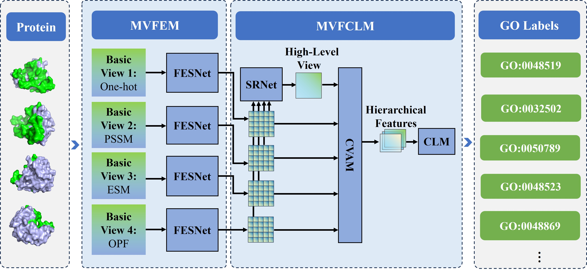
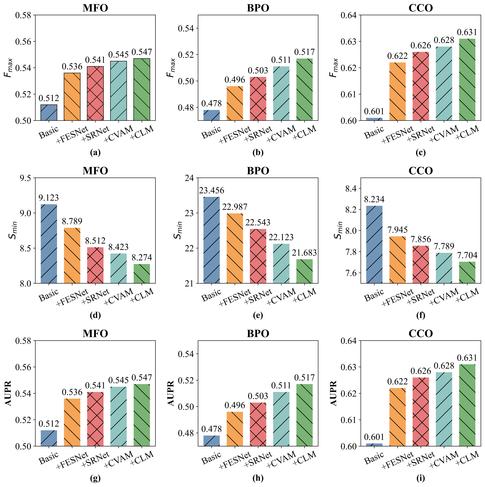
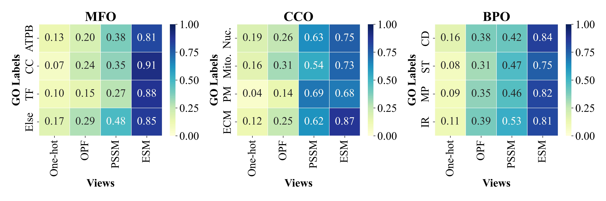
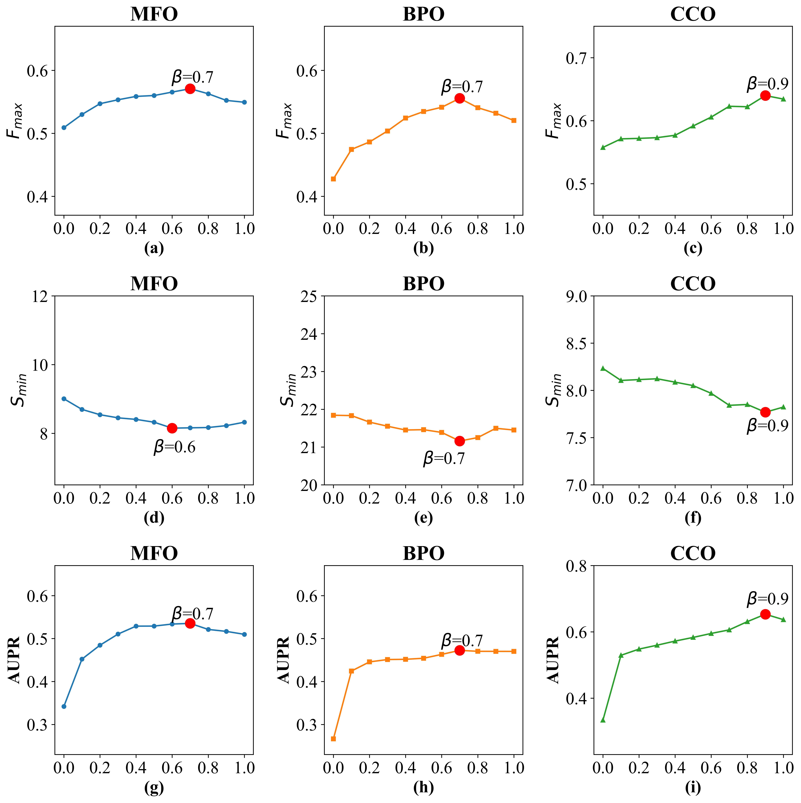

<h1 align="center">
Multi-View Collaboration Feature Fusion for Protein Function Prediction
</h1>
<p align="center">


</p>
<p align="justify">
Automatic Protein Function Prediction (AFP) plays a pivotal role in elucidating the molecular mechanisms underlying biological activities, with significant implications for physiological studies, pathological investigations, and drug development. Despite its importance, AFP still suffers from a widening gap between the rapid growth of protein sequence databases and the limited availability of experimentally annotated proteins, creating an urgent demand for more effective computational methods. However, most deep learning–based AFP approaches face two major limitations: (1) heavy reliance on manually constructed feature sets, and (2) insufficient modeling of sequential information. These constraints limit scalability to large datasets and hinder optimal predictive performance. To overcome these challenges, we propose a Multi-View Collaboration Feature Fusion (MVCFF) framework, which leverages complementary features from multiple sequence perspectives to enhance protein function prediction. In MVCFF, a sequential feature extraction sub-network is designed to capture view-specific information, incorporating both local patterns and long-range dependencies within amino acid sequences. Building on this, a multi-view collaboration paradigm is employed, enabling interactive learning of key positional information through integrated multi-view features and facilitating synergistic information fusion. The resulting multi-view representations are then fed into downstream label predictors to perform classification tasks. To further boost predictive accuracy, we introduce an extended version, MVCFF+, which combines the original MVCFF framework with sequence similarity–based prediction methods via a weighted fusion strategy. Extensive experiments demonstrate that our approach substantially improves prediction performance, outperforming existing methods by a clear margin.
</p>
<p align="center">
 <br>
<b>Figure 1.</b> Architecture of the deep learning framework MVCFF for protein function prediction. MVFEM is the multi-view feature extraction module and MVFCLM is the multi-view feature collaborative learning module incorporating the Shared Regression Network (SRNet), Cross-View Attention Mechanism (CVAM), and Classification Learning Mechanism (CLM) components. The final output is a set of predicted GO labels. 
</p>

### Ablation study

<p align="center">
 <br>
<b>Figure 2.</b> Ablation study results. 
</p>

### Multi-View analysis

<p align="center">
 <br>
<b>Figure 3.</b> Attention maps between MVCFF views and GO labels. 
</p>

### Parameter analysis

<p align="center">
 <br>
<b>Figure 4.</b> The experimental results of MVCFF+ under different values of $\alpha$. 
</p>

## Conda Environment Setup

``` shell
conda create --name mvcff --file ./requirements.txt
conda activate mvcff
```
## Datasets


### **I. CAFA3 gold standard dataset**

<p align="justify">
The CAFA3 gold standard dataset includes training sequences with experimental annotations and a test benchmark. The training set contains 66,841 experimentally annotated proteins, while the test set comprises 3,328 experimentally annotated proteins.
To standardize functional descriptions, we adopted the classification framework provided by the Gene Ontology Consortium. For human proteome sequence data, we obtained the Gene Ontology data (ver.2021.02) from the official Gene Ontology website. This version contains three sub-ontology clusters comprising 44,085 GO labels, including 11,153 Molecular Function Ontology (MFO) class labels, 28,748 Biological Process Ontology (BPO) class labels, and 4,184 Cellular Component Ontology (CCO) class labels. Regarding the CAFA3 gold-standard dataset, we utilized the GO data (ver.2016.06) from the CAFA3 Challenge. This version includes three sub-ontology clusters with 44,091 GO labels, containing 10,693 MFO class labels, 29,264 BPO labels, and 4,134 CCO labels.
`CAFA offical website`: https://biofunctionprediction.org/cafa/.
</p>

<p align="justify">
The solution: The Critical Assessment of protein Function Annotation algorithms (CAFA) is an experiment designed to provide a large-scale assessment of computational methods dedicated to predicting protein function, using a time challenge. Briefly, CAFA organizers provide a large number of protein sequences. The predictors then predict the function of these proteins by associating them with Gene Ontology terms or Human Phenoytpe Ontology terms (Blue “prediction” section of timeline). Following the prediction deadline, we wait for several months. During that time, some proteins whose function were unknown experimentally have received experimental verification (Green “annotation growth” section of timeline). Those proteins constitute the benchmark, against which the methods are tested (Orange “assessment” portion of timeline). You can read about CAFA 3 [here](https://www.biorxiv.org/content/10.1101/653105v1).
</p>


CAFA 3 (2016-2017) download commands as follows:
``` shell
wget https://biofunctionprediction.org/cafa-targets/CAFA3_targets.tgz
wget https://biofunctionprediction.org/cafa-targets/CAFA3_training_data.tgz
```

### **II. Human Proteome Sequence Dataset**

<p align="justify">
Homo sapiens (Homo sapiens sapiens) or modern humans are the only living species of the evolutionary branch of great apes known as hominids. Divergence of early humans from chimpanzees and gorillas is estimated to have occurred between 4 and 8 million years ago. The genus Homo (Homo habilis) appeared in Africa around 2.3 million years ago and shows the first signs of stone tool usage. The exact lineage of Homo species ie: H. habilis/H. ergaster to H. erectus to H. rhodesiensis/H.heidelbergensis to H. sapiens is still hotly disputed. However, continuing evolution and in particular larger brain size and complexity culminates in Homo sapiens. The first anatomically modern humans appear in the fossil record around 200,000 years ago. Modern humans migrated across the globe essentially as hunter-gatherers until around 12,000 years ago when the practice of agriculture and animal domestication enabled large populations to grow leading to the development of civilizations.
</p>

<p align="justify">
To standardize functional descriptions, we adopted the classification framework provided by the Gene Ontology Consortium. For human proteome sequence data, we obtained the Gene Ontology data (ver.2021.02) from the official Gene Ontology website (https://geneontology.org/docs/download-ontology/). This version contains three sub-ontology clusters comprising 44,085 GO labels, including 11,153 Molecular Function Ontology (MFO) class labels, 28,748 Biological Process Ontology (BPO) class labels, and 4,184 Cellular Component Ontology (CCO) class labels. 
</p>

### preprocess
<p align="justify">
In this study, we utilized the human proteome sequence dataset and the CAFA3 gold standard dataset. To mitigate the risk of information leakage caused by homologous sequences, this study employed the CD-HIT tool to cluster and deduplicate the human proteome dataset and CAFA3 gold standard dataset, with a sequence identity threshold set at 30%. For the CAFA3 dataset, we used the OrthoFinder tool to identify orthogroups and removed from the training set all proteins that are orthologous to those in the test species, in order to prevent cross-species information leakage. The human proteome dataset was obtained from the SWISS-PROT database, comprising a training set of 17,740 sequences and a test set of 933 sequences. The training set of the CAFA3 gold standard dataset contains 66,841 experimentally annotated proteins, while the test set comprises 3,328 experimentally annotated proteins.
</p>

## Train

``` python
check_dir(base_path+"output/csv/")
check_dir(base_path+"output/log/")
python train.py --phase train --datasets cafa3 --namespace mf --net_type MVFFNet --feats_type O_B_P --batch_size 8 --num_epochs 12
```

output:

``` shell
model_test.pth.tar
prediction.pkl
result.txt
```

## Test

``` python
check_dir(base_path+"output/csv/")
check_dir(base_path+"output/log/")
python train.py --phase test --datasets cafa3 --namespace mf --net_type MVFFNet --feats_type O_B_P --batch_size 8
```

output:

``` shell
prediction.pkl
result.txt
```

**Cite Our Paper**

``` bibtex
@article{yang2026multiview,
  title   = {Multi-View Collaborative Feature Fusion for Protein Function Prediction},
  author  = {Yang, Hailong and Wang, Zhongyu and Shi, Haijun and Ning, Qiao and Deng, Zhaohong and Hu, Shudong and Zhong, Yanqi},
  journal = {Journal of Chemical Information and Modeling},
  year    = {2026},
  doi     = {10.1021/acs.jcim.5c03057}
}
```